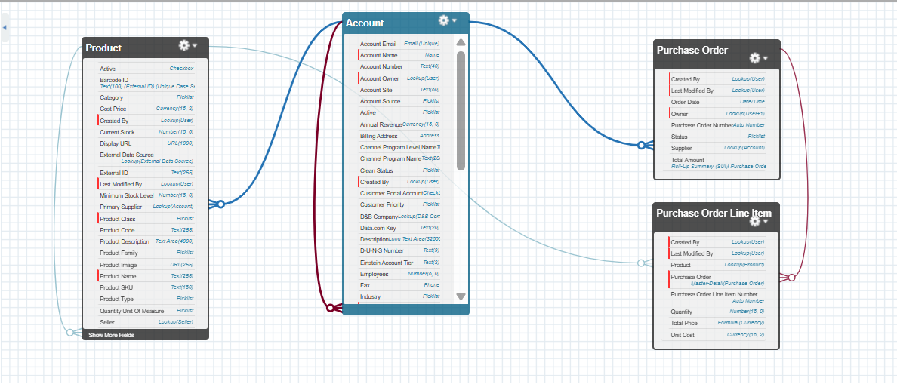
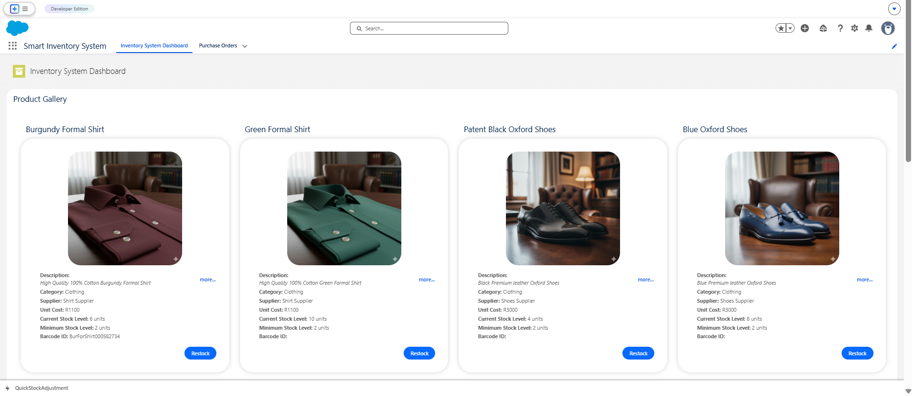
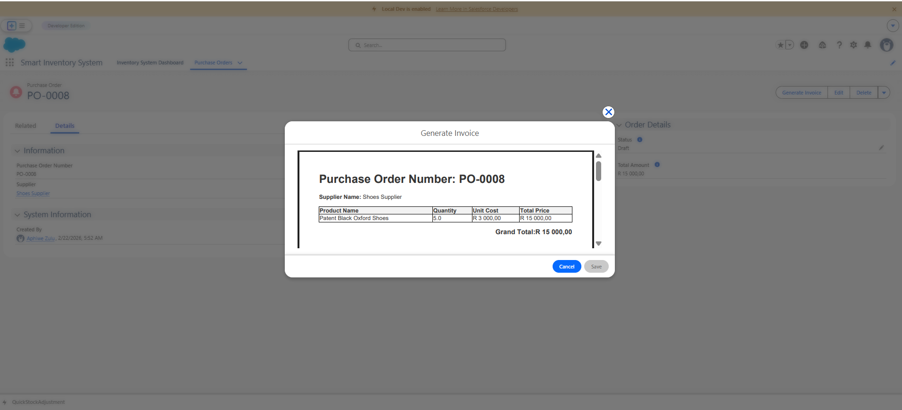
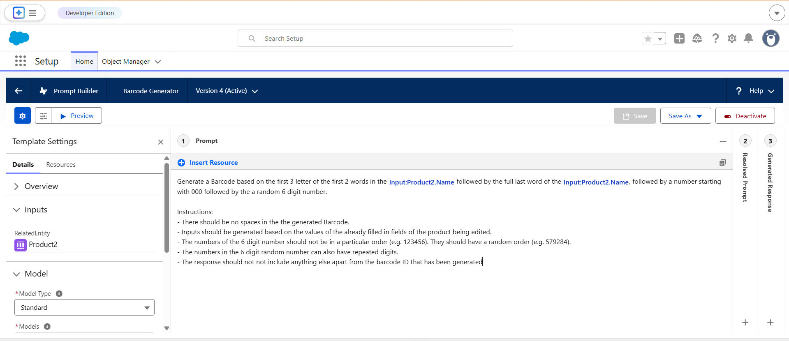
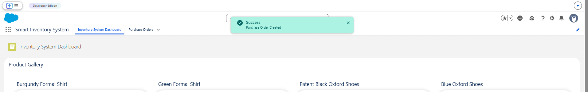
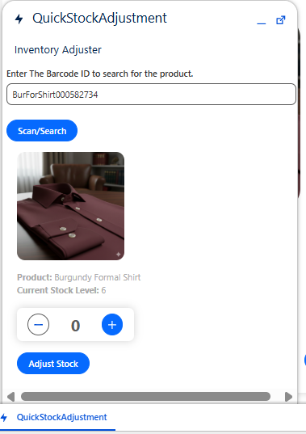
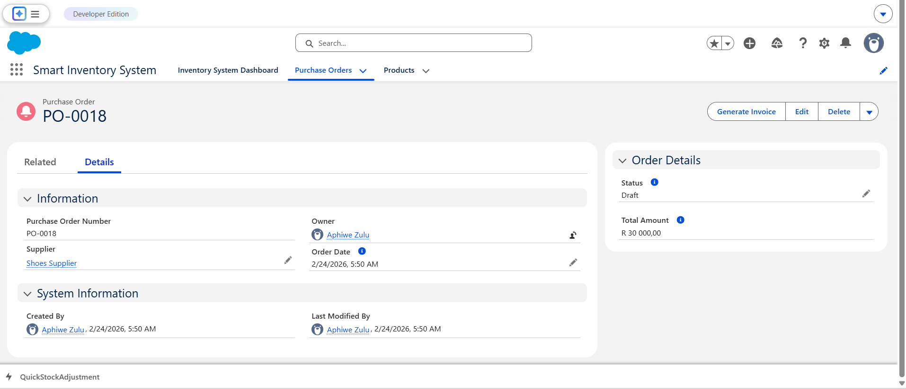
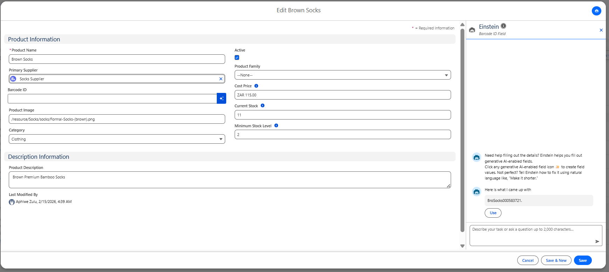

# **Project Documentation: Inventory Management & PO Generation System**

**Version:** 1.0  
**Author:** [Your Name]  
**Date:** February 24, 2026  

## **1. Executive Summary**
The Inventory Management & PO Generation System is a custom Salesforce application designed to streamline warehouse operations. It provides users with a real-time visual grid of product inventory, a quick-access barcode scanning utility for rapid stock adjustments, automated/manual Purchase Order (PO) generation to maintain optimal stock levels, and Generative AI to automate product data entry. 

## **2. System Architecture & Data Model**
The system is built on a custom data model centered around the standard `Product2` object, extending its capabilities to handle inventory levels, minimum thresholds, and supplier relationships.

### **2.1. Object Schema**

| Object | Type | Key Custom Fields | Relationships |
| :--- | :--- | :--- | :--- |
| **Product (`Product2`)** | Standard | `Current_Stock_Level__c`, `Minimum_Stock_Level__c`, `Barcode_ID__c` (AI-Generated), `Primary_Supplier__c`, `Product_Image__c` | Parent to PO Line Item |
| **Purchase Order (`Purchase_Order__c`)** | Custom | `Status__c`, `Order_Date__c`, `Total_Amount__c` (Roll-up) | Lookup to `Account` (Supplier) |
| **PO Line Item (`Purchase_Order_Line_Item__c`)** | Custom | `Quantity__c`, `Unit_Cost__c`, `Total_Price__c` (Formula) | Master-Detail to PO, Lookup to Product |

()

---

## **3. Component Specifications**

### **3.1. Frontend Components (User Interface)**

#### **Product Gallery (Lightning Web Component)**
* **Description:** A responsive grid displaying all active products, their images, current stock levels, and a "Restock" action.
* **Key Features:** Uses `@wire` to fetch data, dispatches `ShowToastEvent` for user feedback, and listens for platform events to automatically refresh data when stock is updated elsewhere.
* **Location:** Main App Page.

()

#### **Quick Adjust Scanner (Aura Component)**
* **Description:** A compact utility tool allowing warehouse workers to scan a `Barcode_ID__c` and rapidly increment or decrement stock using `+` and `-` buttons.
* **Key Features:** Utilizes Client-Side and Server-Side controllers. Broadcasts an Application Event (or LMS) upon successful DML update to sync with the LWC grid.
* **Location:** Application Utility Bar.

()

#### **Purchase Order Invoice (Visualforce)**
* **Description:** A printable, PDF-rendered invoice detailing the Purchase Order and its associated Line Items.
* **Key Features:** Uses `renderAs="pdf"`, `<apex:outputField>` for dynamic currency localization (e.g., Rands/Dollars based on user locale), and `<apex:repeat>` to iterate through related child records.

()

---

### **3.2. Backend Logic (Apex & Automation)**

#### **Apex Controllers & Triggers**
* **`ProductController.cls`**: Centralized logic handler with `with sharing` applied. Handles `@AuraEnabled` methods for querying products (`getProducts`), adjusting stock via barcode (`adjustStock`), and creating manual POs (`createSinglePO`).
* **`ProductTrigger` & `ProductTriggerHandler`**: Enforces database integrity. An `isBefore` and `isUpdate` context prevents `Current_Stock_Level__c` from dropping below 0, throwing a custom error.

#### **Automated Batch Processing**
* **`InventoryCheckBatch.cls`**: A nightly scheduled batch class implementing `Database.Batchable`. 
* **Logic:** Queries all products where `Current_Stock_Level__c < Minimum_Stock_Level__c`. Groups these products by `Primary_Supplier__c` and automatically generates Draft `Purchase_Order__c` records and line items to replenish stock to optimal levels.

---

### **3.3. Generative AI Integration (Prompt Builder)**

#### **Field Generation Prompt Template**
* **Target Field:** `Product2.Barcode_ID__c`
* **Description:** Utilizes Salesforce Prompt Builder to automatically draft a standardized, unique Barcode ID for new products. 
* **Logic:** The prompt template evaluates contextual record data (such as Product Name, Family, and Supplier details) to generate an alphanumeric string that adheres to the company's internal barcode naming conventions, saving time and reducing manual entry errors.

()

---

## **4. User Workflow Guide**

### **Scenario A: Manual Restocking**
1. Navigate to the **Inventory App**.
2. Review the **Product Gallery**.
3. Click the **Restock** button on a depleted product.
4. A success toast appears, and a new `Purchase_Order__c` is created in the database.

()

### **Scenario B: Rapid Stock Adjustment (Utility Bar)**
1. Click **Quick Adjust** in the Utility Bar.
2. Enter the Product Barcode and click **Scan/Search**.
3. Click the **+** or **-** buttons to adjust physical inventory.
4. Observe the LWC Product Gallery dynamically update its numbers in the background without a page refresh.

()

### **Scenario C: Generating the PO PDF**
1. Navigate to the **Purchase Orders** tab.
2. Open a specific PO record.
3. Click the **Generate Invoice** Quick Action (or navigate to the VF URL).
4. Save or print the generated PDF document.

()

### **Scenario D: AI-Assisted Barcode Generation**
1. Create a new **Product** or edit an existing one.
2. Navigate to the **Barcode ID** field.
3. Click the **Einstein** icon next to the field to draft the Barcode using the AI prompt template.
4. Review the generated Barcode ID and click **Use** to populate the field.

()

---

## **5. Deployment & Setup Instructions**
To deploy this project to a new environment, follow these steps:
1. **Deploy Metadata:** Push objects, classes, LWC, Aura, VF pages, and Prompt Templates (`.genPrompt` metadata) via Salesforce CLI or Change Sets.
2. **Assign Permissions:** Ensure users have the appropriate CRUD and FLS permissions, plus the "Prompt Template User" permission set for AI features.
3. **Schedule Batch:** Go to **Setup** -> **Apex Classes** -> **Schedule Apex** and schedule `InventoryCheckBatch` to run daily at 12:00 AM.
4. **Configure Utility Bar:** Add the `QuickStockAdjust` component to the App's Utility Bar via the App Manager.